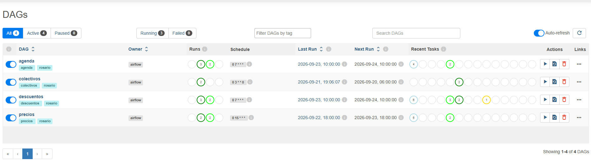
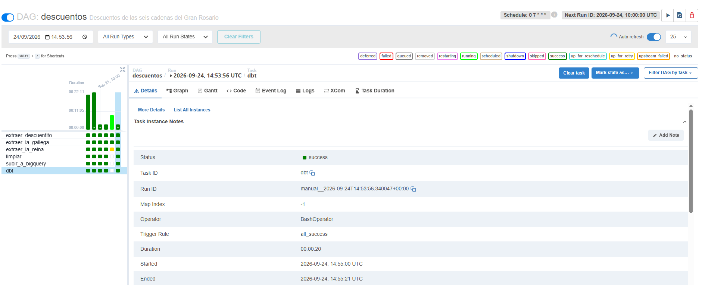

# Rosario Vivo

Agente conversacional sobre datos abiertos del Gran Rosario: precios de
supermercados, descuentos bancarios, colectivos, agenda cultural, clima y
cotizaciones.

Podés preguntarle en castellano y te contesta con datos reales, actualizados
todos los días por un pipeline propio.

```
Vos: ¿qué descuentos tengo con Personal Pay?
Rosario: En La Reina tenés 10% de reintegro los sábados, con compra mínima
de $30.000 y tope de $7.000 por semana, pagando con tarjeta física o QR
desde la app. Vigente hasta el 30/09.

Vos: ¿los jubilados tienen descuento en La Reina?
Rosario: Sí, dos:
  - 10% los martes y jueves, exclusivo para compras en sucursales
  - 10% los lunes y martes presentando carnet de ANSES

Vos: ¿dónde está más barata la leche?
Rosario: LECHE ENTERA ULTRA FORTIF. SACHET, 1 l — $1507
La Anónima, Blvd. Oroño 6000, Villa Gobernador Gálvez
```

---

## Por qué existe

Mi hermana no sabía qué descuentos tenía disponibles ni qué días le convenía
comprar. Terminó comparando a mano, precio por precio, La Reina contra Coto,
y se cambió de supermercado cuando descubrió que tenía un 30% de reintegro
que no estaba usando.

Esa información existe, es pública y está dispersa en ocho lugares distintos:
un dataset nacional de 1,65 GB, la API de una cadena, la web de otra y
carteles publicados como imágenes. Este proyecto la junta, la limpia y la
deja disponible para preguntarle en castellano.

---

## Arquitectura

```
  FUENTES                    EXTRACCIÓN        TRANSFORMACIÓN      CONSUMO
                             ╰──── local ────╯  ╰─ BigQuery ─╯     ╰─ Railway ─╯

  SEPA (1,65 GB/día)    ─┐
  descuentito-data       │
  API propia de Coto     ├──►  Python     ──►  BigQuery  ──►  dbt  ──►  Agente
  web de La Gallega      │     + Vision        (raw_*)        (staging    (OpenAI
  web de La Reina        │       OCR                          + marts)   function
  agenda municipal       │                                               calling)
  API de colectivos     ─┘                                                  │
                              ╰────────── Airflow ──────────╯               │
                                                                            ▼
                                                        FastAPI ──► React (SSE)
                                                           │         anillos, voz
                                                           ▼         y micrófono
                                                        Postgres
                                                        (sesiones)
```

Cuatro DAGs orquestan todo:

| DAG | horario (Rosario) | qué hace |
|---|---|---|
| `precios` | 15:00 de lunes a viernes | SEPA → limpieza → BigQuery → dbt |
| `descuentos` | 07:00 diario | 3 extracciones en paralelo → limpieza → BigQuery → dbt |
| `agenda` | 07:00 diario | scraping → BigQuery → dbt |
| `colectivos` | domingo 03:00 | recorridos y paradas → BigQuery → dbt |



El DAG de descuentos extrae de tres fuentes en paralelo antes de unificarlas:



---

## Qué datos tiene

### Precios — 159.575 registros

Del dataset SEPA de la Secretaría de Comercio, filtrado al Gran Rosario.

| cadena | sucursales |
|---|---|
| Hipermercado Carrefour | 5 |
| COTO CICSA | 5 |
| Supermercados DIA | 2 |
| La Anónima | 1 |
| Jumbo | 1 |
| Vea | 1 |
| SIMPLICITY | 1 |

**Cobertura real: 15 supermercados de los ~28 del Gran Rosario.** Las cadenas
rosarinas (La Gallega, La Reina, Arcoiris, Dar, Micro Go, Libertad) no
publican en SEPA y por lo tanto no tienen precios acá. Está medido, no
estimado: ver *Limitaciones*.

### Descuentos — 194 promociones vigentes, 6 cadenas

| cadena | fuente | promos |
|---|---|---|
| Jumbo | descuentito-data | 61 |
| Coto | API propia (`getPromocionesMulticanal`) | 75 |
| Carrefour | descuentito-data | 30 |
| La Reina | web propia + OCR de los carteles | 15 |
| La Gallega | web propia (7 días) | 12 |
| DIA | descuentito-data | 1 |

### Otros

- **Colectivos**: 53 líneas, 8.733 paradas, 36.058 puntos de trazado, con
  llegadas en tiempo real
- **Agenda cultural**: ~190 eventos de la Municipalidad de Rosario
- **Clima** y **cotizaciones**: en vivo, sin almacenamiento

---

## La interfaz

El agente corre detrás de una API en FastAPI y una interfaz en React.

- **Respuestas en streaming**: el texto aparece a medida que se genera, y la
  interfaz muestra en qué está trabajando (consultando datos, respondiendo).
- **Voz**: Rosario puede leer sus respuestas en voz alta. No lee la lista
  entera: un resumen armado en código cuenta el primer resultado y avisa que
  el resto está a la vista. Once colectivos son once líneas en pantalla, pero
  una sola oración al escucharlos.
- **Micrófono**: se le puede hablar en vez de escribir. El audio se transcribe
  en el servidor, no en el navegador, porque `speechSynthesis` depende de las
  voces instaladas en cada máquina y en muchas no hay ninguna en español.
- **Sesiones en Postgres**: la conversación sobrevive a un reinicio del
  servidor y se borra sola a las 2 horas sin actividad.

---

## Decisiones técnicas

Las que cambiaron el resultado, con el motivo.

### PySpark se sacó del proyecto después de medirlo

El pipeline de precios empezó con Spark por el tamaño del dataset. Al
verificar el resultado contra los CSV crudos, Spark devolvía **61.103 filas
donde había 159.575**: perdía el 62% de los datos sin lanzar un solo error.

Se reemplazó por pandas leyendo por trozos de 200.000 filas, filtrando contra
un `MultiIndex` y convirtiendo tipos recién al final, sobre 159 mil filas en
vez de 14,7 millones. Corre en menos de un minuto y el resultado coincide
sucursal por sucursal con la fuente.

La conclusión no es que Spark sea malo: es que 1,65 GB no justifica una JVM,
y que una herramienta que falla en silencio es peor que una lenta.

### El OCR se eligió midiendo, no por intuición

La Reina publica el porcentaje y el día **dentro de la imagen** del cartel, no
en el texto. Sin leer la imagen, de 15 promociones quedaban 12 sin porcentaje
y casi todas sin día.

Se armó `tests/verdad_lareina.json` con los valores leídos a ojo de cada
cartel, y con ese set se midió cada intento:

| intento | aciertos |
|---|---|
| Tesseract, imagen completa | 3 / 15 |
| + imagen original en vez de la miniatura | 11 / 15 |
| + recorte de la zona del número y lista blanca de dígitos | 12 / 15 |
| **Google Cloud Vision** | **15 / 15** |

Tesseract partía los números grandes y se comía el primer dígito: leía "0%"
donde decía "10%" y, peor, "45%" donde decía "15%". Un valor inventado y
plausible es más peligroso que un nulo.

**Por qué acá sí y en los folletos de precios no:** son 15 imágenes, el texto
es grande y sobre fondo plano, se buscan sólo dos datos de forma muy acotada,
y sobre todo **se puede verificar**. En un folleto de precios hay cientos de
productos, números de cuatro dígitos y ninguna forma de comprobar la lectura.

### Verificar el sentido contra el recorrido real

Google devolvía paradas donde el colectivo pasa en sentido contrario al del
viaje. El sistema lo detecta porque tiene con qué comparar: los recorridos
completos de las 53 líneas, punto por punto, extraídos de la Municipalidad.

Si sobre el trazado la parada de bajada aparece **antes** que la de subida, ese
colectivo va para el otro lado. Cada tramo se etiqueta con el resultado:

| `sentido_verificado` | qué significa |
|---|---|
| `correcto` | la parada sirve para ese viaje |
| `sentido_invertido` | Google mandaba mal y el sistema la reemplazó |
| `no_verificable` | no hay datos del recorrido para confirmarlo |

Con el tiempo el caso `sentido_invertido` se volvió mucho menos frecuente,
pero el guardia sigue: una fuente externa puede volver a fallar, y el costo de
verificar es una comparación de índices.

### Los recorridos se leen de BigQuery, no de archivos

La búsqueda de directos leía los recorridos de tres CSV en disco. Funcionaba en
la máquina de desarrollo y falló apenas la app se desplegó: el contenedor no
lleva archivos de datos adentro.

Toda la lectura estaba concentrada en una función, así que el cambio fue
reemplazar esa función por tres consultas y dejar intacta la lógica de
verificación de sentidos. Los datos pasaron por dbt como el resto: el casteo de
tipos deja de depender de la versión de pandas de cada entorno, y hay tests
declarativos que verifican que no falten coordenadas ni el orden de los puntos
del trazado, que es justamente lo que hace funcionar la verificación de sentido.

### El robots.txt de La Gallega cambió el diseño del scraper

El sitio muestra un día por vez y la única forma de pedir otro es
`PromoxDia.asp?Dia=N`. Su `robots.txt` desaconseja las URLs con query string.
El scraper se corre una vez, con pausa entre pedidos, y queda separado del
pipeline diario para que la excepción sea explícita.

### Una fila por promoción, no una por día

La primera versión guardaba una fila por cada combinación de promoción, día y
medio de pago: 539 filas para 194 promociones. El problema no era el espacio,
era la respuesta del agente: recibía la misma promo de Coto siete veces y la
repetía siete veces.

Ahora los días, las entidades y los medios de pago son arrays de BigQuery. La
consulta usa `unnest` y el agente ve 194 promociones reales.

### Las fechas viajan como texto

Al mover la limpieza al contenedor de Airflow, con otra versión de pandas y
pyarrow, BigQuery empezó a leer las fechas como `INT64` y dbt no podía
castearlas. Ahora se guardan como texto ISO y se convierten en dbt con
`parse_date`: el resultado es idéntico corra donde corra.

### El precio por kilo no se copia de la fuente: se calcula

Los fideos de Carrefour figuraban a **$4.380.000 el kilo**. El error no era
puntual: afectaba al 46% de la columna.

El origen son dos campos de SEPA que fallan en filas distintas.
`cantidad_referencia` dice "1" en el 54% de las filas (una caja de 228 gr
aparece como "1 KG") y `precio_referencia` trae la escala corrida en unas
8.500 (un alfajor de 38 gr a $600 daba $1.578 el kilo cuando son $15.789).

El desempate está en la descripción del producto, que trae el contenido real:
"X 70 GRS", "200 ML", "PAQ-500-gr.". De 89.840 filas con contenido legible,
`precio_referencia` coincide en 81.433 y el cálculo por cantidad en 40.145,
así que la descripción manda y la fuente queda como respaldo.

Dos tests de dbt lo sostienen: uno verifica que el precio por unidad coincida
con dividir el precio por el contenido, y otro que no queden precios por kilo
imposibles. Ese test es el que hubiera cazado el error desde el principio.

### El precio por unidad ordena, pero no se muestra

Comparar por kilo o litro es lo que hace útil al comparador: un sachet de 1 L
a $1.790 es más barato que una botella de 900 ml a $1.700, y el número de
góndola dice lo contrario.

Pero "$15.789 el kilo de alfajor" es una cifra que nadie va a pagar. El
precio por unidad se calcula y se usa para ordenar los resultados; lo que se
muestra es el contenido del envase y lo que sale en la caja.

### Lo que el modelo hace mal se resuelve en código

Regla del proyecto: **si se puede resolver con un `if` en Python, no va en el
prompt.**

- **Comparaba mal los precios.** Con una lista de envases distintos elegía el
  número más chico. La herramienta ahora calcula cuál conviene y se lo pasa
  masticado.
- **Inventaba productos.** Ante "¿qué conviene hoy?" llamaba a la búsqueda de
  precios con "leche", "yerba" y "fideos", que el usuario nunca nombró. Una
  guardia compara los argumentos contra lo que la persona escribió y rechaza
  lo que no está.
- **Inventaba direcciones.** Preguntando "¿cómo voy al Monumento?" sin decir
  de dónde, el modelo completaba el origen con un ejemplo del prompt. Se
  resolvió de dos lados: los ejemplos del prompt dejaron de ser direcciones
  reales, y el parámetro `origen` pasó a ser opcional para que la herramienta
  pueda responder "preguntale de dónde sale" en vez de forzar una invención.
- **Rankeaba descuentos inútiles.** El 40% de Credicoop no le sirve a alguien
  que no tiene Credicoop. Cuando la pregunta es general, la herramienta no
  devuelve promociones: devuelve las entidades disponibles y le indica al
  agente que pregunte con qué paga.
- **Buscaba "leche" y traía alfajores**, porque "dulce de leche" contiene la
  palabra y las golosinas son más baratas. Se resolvió con relevancia por
  posición de la palabra.
- **Contestaba de memoria los seguimientos.** A "¿y mañana?" respondía sin
  llamar a ninguna herramienta, copiando mal su propia respuesta anterior. Las
  palabras de fecha ahora fuerzan la llamada, y si el usuario nombró un día y
  el modelo no lo pasó, se completa en código.

### El estado de las guardias es por sesión, no global

Las guardias que frenan las invenciones del modelo necesitan saber qué
escribió el usuario. En la versión de terminal eso vivía en variables globales
del módulo, que con un solo usuario funciona bien.

En la web no: dos personas preguntando a la vez compartían el mismo estado, y
la guardia de una comparaba contra el mensaje de la otra. Peor todavía, una
dirección validada para un usuario quedaba aceptada para todos.

Ahora cada sesión tiene su propio contexto y una `ContextVar` indica cuál está
activo. Si el código olvida activarlo, falla de inmediato en vez de compartir
uno por defecto: un olvido tiene que romper en desarrollo, no mezclar datos en
producción sin que nadie se entere. Hay un test que levanta dos hilos y
verifica que sus contextos no se toquen.

### La voz dice una cosa y la pantalla otra

Pedirle al modelo que escriba corto para la voz arruina lo que se lee. La
respuesta lleva dos versiones: la lista completa para la pantalla y, para el
audio, un resumen armado **en código** a partir de los campos que devolvió la
herramienta.

Eso tiene un efecto secundario que importa: la voz no puede inventar. No lee
lo que escribió el modelo, lee datos.

---

## Seguridad

El link es público y cada consulta cuesta dinero, así que la protección es
parte del diseño y no un agregado.

| Riesgo | Cómo se controla |
|---|---|
| Alguien automatiza consultas y gasta la cuenta de OpenAI | Límite por IP: 10 por minuto y 150 por día, más un tope global diario |
| Abuso del audio, que cuesta por carácter | 1 audio por minuto por sesión y 200 por día entre todos |
| Un usuario ve la conversación de otro | Cada sesión es un UUID v4 imposible de adivinar, y el servidor valida el formato |
| Errores que revelan la estructura interna | Los errores devuelven un mensaje genérico; el detalle queda en el log |
| La documentación automática expone los endpoints | `/docs` y `/openapi.json` deshabilitados |
| El modelo filtra el prompt o cambia de identidad | Probado con cuatro ataques de prompt injection; el prompt lo resiste |
| Pedidos gigantes | Tope de tamaño del cuerpo antes de procesarlo |
| Claves de Google filtradas | Cuotas diarias por API, restricción por API y cuentas de servicio con permisos mínimos |

Las credenciales viven en variables de entorno y el historial de git está
verificado: nunca se subió un `.env` ni un archivo de credenciales.

---

## Dónde corre cada cosa

| Parte | Dónde | Por qué |
|---|---|---|
| Agente, API y web | Railway | Link público con HTTPS, que el micrófono necesita |
| Sesiones del chat | Postgres en Railway | Al lado de la app, sin salir a internet |
| Datos | BigQuery | Es donde ya vivían |
| Airflow y los 4 DAGs | Local | Un entorno gestionado de orquestación cuesta más de lo que aporta en un proyecto personal |

La consecuencia de tener Airflow en local es explícita: **los datos se
actualizan cuando la máquina está encendida.** Para las fuentes que publican
una vez por día no cambia mucho, y el agente avisa en cada respuesta que los
precios son de la última publicación.

La app no lleva credenciales de archivo: la cuenta de servicio de Google entra
como variable de entorno y tiene sólo permiso de lectura sobre BigQuery. El
agente no puede escribir en los datos porque no lo necesita.

---

## Limitaciones conocidas

Están acá porque un dato que parece completo y no lo es hace más daño que un
dato ausente.

- **Precios: 15 de ~28 supermercados.** Las cadenas rosarinas no publican en
  SEPA. Se evaluó scrapearlas: La Gallega tenía la tienda en mantenimiento,
  Arcoiris vende por WhatsApp y La Reina pide login. Sólo quedaban folletos en
  imágenes, que requerirían OCR sobre cientos de precios sin forma de
  verificarlos. Se documentó la limitación en vez de publicar precios que
  podrían estar mal leídos.
- **SEPA no publica los fines de semana.** El sitio no responde sábados ni
  domingos (verificado tres días seguidos). El DAG corre de lunes a viernes.
- **Los precios son de la última publicación de SEPA**, que es diaria: pueden
  no coincidir con la góndola de hoy. El agente lo aclara en cada respuesta.
- **descuentito-data acumula promociones vencidas.** De las 65 de DIA sólo 1
  seguía vigente, y las 18 de Coto habían vencido dos meses antes. Se filtra
  por fecha de vigencia y Coto se lee de su API propia.
- **Algunas promociones no publican vigencia.** Cuando no hay fecha se dejan
  pasar en vez de descartarlas: la mayoría de las promos bancarias no publican
  fin y descartar por falta de dato perdería más promos buenas de las que
  evitaría mostrar vencidas.
- **La Gallega necesita siete corridas** para tener la semana completa, porque
  el sitio muestra un día por vez.

---

## Stack

| capa | herramienta |
|---|---|
| extracción | Python, requests, BeautifulSoup |
| OCR | Google Cloud Vision |
| procesamiento | pandas (por trozos) |
| almacenamiento | BigQuery |
| transformación | dbt (staging en vistas, marts en tablas, tests declarativos) |
| orquestación | Airflow en Docker |
| agente | OpenAI function calling (gpt-4o-mini) |
| API | FastAPI con streaming SSE |
| interfaz | React (Vite), SVG animado, sin librerías de UI |
| sesiones | Postgres |
| deploy | Docker en Railway, con Postgres gestionado |

---

## Cómo correrlo

### Requisitos

- Python 3.12 y [uv](https://docs.astral.sh/uv/)
- Node.js 20 y Docker
- Un proyecto de Google Cloud con BigQuery y Vision habilitadas
- Una API key de OpenAI

### Puesta en marcha

```bash
git clone https://github.com/ivanorquera95/Agent_Rosario.git
cd Agent_Rosario
uv sync

# credenciales de Google
gcloud auth application-default login
gcloud services enable vision.googleapis.com

# la API key de OpenAI
echo "OPENAI_API_KEY=sk-..." > .env
```

### El pipeline a mano

```bash
# precios
uv run ./scripts/precios/extraccion_precios.py
uv run ./scripts/precios/limpieza_precios.py
uv run ./scripts/precios/subir_precios_bigquery.py

# descuentos
uv run ./scripts/descuentos/extraccion_descuentos.py
uv run ./scripts/descuentos/extraccion_lagallega.py
uv run ./scripts/descuentos/extraccion_lareina.py
uv run ./scripts/descuentos/limpieza_descuentos.py
uv run ./scripts/descuentos/subir_descuentos_bigquery.py

# transformación
cd agent_rosario_dbt && uv run dbt build --profiles-dir .
```

### El pipeline con Airflow

```bash
cd airflow
cp .env.ejemplo .env      # ajustar rutas y credenciales
mkdir dags logs
docker compose up init
docker compose up -d
```

La interfaz queda en `http://localhost:8080`.

### El agente por terminal

```bash
uv run ./agent_rosario.py
```

### La interfaz web

```bash
docker compose up -d postgres-app   # base de sesiones
uv run uvicorn api.main:app --reload --reload-dir api --reload-dir scripts

cd web && npm install && npm run dev
```

Queda en `http://localhost:5173`.

### Los tests

```bash
uv run pytest                                    # 108 tests
cd agent_rosario_dbt && uv run dbt test          # tests de datos
```

### El deploy

La imagen de Docker compila el frontend y lo sirve desde FastAPI, así que es un
solo servicio. Railway la construye en cada push a `main`.

```bash
docker build -t rosario .
```

Variables que necesita: `OPENAI_API_KEY`, `GOOGLE_PLACES_API_KEY`,
`GOOGLE_CLOUD_PROJECT`, `GOOGLE_CREDENCIALES_JSON` (el contenido de la clave de
la cuenta de servicio) y `DATABASE_URL`.

---

## Estructura

```
├── agent_rosario.py          el agente: tools, guardias y bucle de chat
├── rosario.md                el system prompt
├── api/                      FastAPI: chat en streaming, sesiones, voz
├── web/                      React: chat, anillos animados, voz y micrófono
├── agent_rosario_dbt/        modelos dbt (staging y marts)
├── airflow/
│   ├── dags/                 los cuatro DAGs
│   ├── Dockerfile
│   └── docker-compose.yml
├── scripts/
│   ├── precios/              SEPA: extracción, limpieza, carga, consulta
│   ├── descuentos/           5 fuentes, unificación y consulta
│   ├── colectivos/           recorridos, paradas y llegadas en vivo
│   ├── agenda/               agenda cultural municipal
│   ├── clima/  monedas/  lugares/
│   └── comun/                contexto por sesión y resumen hablado
├── Dockerfile                imagen de la app (frontend + API)
├── docker-compose.yml        Postgres de sesiones
└── tests/
    └── verdad_lareina.json   set de verdad para medir el OCR
```

---

## Qué falta

- DIA se quedó con una sola promoción vigente: le falta fuente propia
- Billetera Santa Fe (operada por PlusPagos) tiene una promoción única para
  los supermercados adheridos a CASAR, que incluye cadenas rosarinas sin
  cobertura acá (Dar, Arco Iris, El Solar). Es una sola promoción con muchos
  comercios, no una por cadena: aportaría alcance, no variedad
- La clave de Google Maps no está restringida por IP porque Railway no asigna
  una fija. Las cuotas diarias por API son la protección que sí aplica